# 🏗️ VolatilityHunter Architecture Visual Guide

## 📋 Table of Contents
- [System Overview](#system-overview)
- [Entry Points](#entry-points)
- [Core Architecture](#core-architecture)
- [Data Flow](#data-flow)
- [Strategy Layer](#strategy-layer)
- [Execution Layer](#execution-layer)
- [Risk Management](#risk-management)
- [Communication Flow](#communication-flow)
- [Error Handling](#error-handling)
- [Sweet Spot Integration](#sweet-spot-integration)

---

## 🎯 System Overview

### The Big Picture

Think of VolatilityHunter like a smart robot that trades stocks automatically. Here's how it all fits together:

```
🌅 Every Morning (Task Scheduler)
    ↓
🤖 Health Check (Are we ready to trade?)
    ↓
🧠 Main Trading Brain (Analyze 2,000+ stocks)
    ↓
💰 Make Trades (Buy low, sell high)
    ↓
📧 Send Report (Tell you what happened)
```

### All the Players (Simple Map)

**What the boxes mean:**
- 🌍 **Outside World** - Things we don't control (stock market, email, etc.)
- 🚪 **Starting Points** - The 4 buttons that start everything
- 🧠 **Smart Brain** - The thinking parts that make decisions
- 📚 **Library** - Where we store information

**How they connect:**
- **Lines show who talks to whom**
- **Arrows show the direction of information**
- **Boxes show different parts of the system**

```
🌍 Outside World
├── 💰 Stock Market (where we buy/sell)
├── 📧 Your Email (where we send reports)
├── 🏦 Trading Account (IBKR - our broker)
└── ⏰ Computer Clock (when to start)

↓ (connects to)

🚪 Starting Points
├── 🏥 Health Doctor (checks if we're healthy)
├── 🧠 Main Trading Brain (does all the work)
├── 🎮 Daily Starter (presses the start button)
└── 💗 Heartbeat Keeper (keeps connection alive)

↓ (connects to)

🧠 Smart Brain
├── 🏭 Strategy Factory (chooses which strategy to use)
├── 🎯 Sweet Spot Strategy (our smart trading method)
├── 📈 Basic Strategy (simple trading method)
├── ⚡ Trade Executor (actually buys/sells stocks)
└── 💼 Wallet Manager (tracks your money)

↓ (connects to)

📚 Library
├── 📊 Market Data (stock price history)
├── 💾 Memory Bank (saves your portfolio)
└── 📔 Daily Log (writes down everything that happens)
```

---

## 🚪 Entry Points

### The Four Starting Buttons

Think of these like the four different buttons you can press to start the system:

| Button | What It Does | When It Runs | What You Get |
|--------|-------------|--------------|--------------|
| **🎮 Daily Starter** (`run_trading.bat`) | The main button that starts everything | Every morning automatically | Nothing (just starts other programs) |
| **🏥 Health Doctor** (`health_check.py`) | Checks if the system is healthy | First thing every morning | Health report email |
| **🧠 Trading Brain** (`main_unified.py`) | The main program that does all the trading | After health check passes | Trading report email |
| **💗 Heartbeat Keeper** (`tws_keep_alive.py`) | Keeps trading connection alive | All day while trading | Nothing (runs in background) |

### How the Morning Routine Works

```
⏰ Computer Clock (9:00 AM)
    ↓
🎮 Daily Starter wakes up
    ↓
🏥 Health Doctor checks everything first
    ↓ "I'm healthy!" 📧
    ↓
🧠 Trading Brain starts working
    ↓ "Here's what I did today!" 📧
    ↓
💗 Heartbeat Keeper runs all day
```

### What Each Button Actually Does

**🎮 Daily Starter (`run_trading.bat`)**
- Like the main power button
- Runs automatically every morning
- Starts the Health Doctor first
- Then starts the Trading Brain
- Keeps the Heartbeat Keeper running

**🏥 Health Doctor (`health_check.py`)**
- Like a doctor giving you a checkup
- Checks internet connection
- Checks trading account connection
- Checks if we can get stock prices
- Sends you a health report

**🧠 Trading Brain (`main_unified.py`)**
- The smart part that does all the work
- Looks at 2,000+ stocks
- Decides which ones to buy/sell
- Makes the actual trades
- Sends you a daily report

**💗 Heartbeat Keeper (`tws_keep_alive.py`)**
- Like a pacemaker for the trading system
- Keeps the trading connection alive
- Runs quietly in the background
- Prevents the system from falling asleep
    participant TWS as tws_keep_alive.py
    
    TS->>Batch: Daily execution
    Batch->>HC: System health check
    HC->>Batch: Health status
    Batch->>MU: Main trading execution
    MU->>Batch: Trading results
    Batch->>TWS: Start TWS keep-alive
    TWS->>Batch: Heartbeat status
```

---

## 🏛️ Core Architecture

### The Three Main Parts (The Three Pillars)

Think of the system like building with three strong pillars - each one has a special job:

```
🛡️ Pillar 1: The Guard (Safety First)
├── 🏥 Health Doctor (checks if system is ready)
├── 🛡️ Safety Shields (protects from bad trades)
└── ✅ System Validator (makes sure everything works)

↓

📚 Pillar 2: The Historian (The Memory Keeper)
├── 🌍 Universe Updater (gets all stock symbols)
├── 📊 Data Loader (loads stock price history)
└── 💾 Storage Layer (saves everything)

↓

🎯 Pillar 3: The Hunter (The Money Maker)
├── 🧠 Main Trading Brain (runs everything)
├── 🎯 Strategy Engine (decides what to buy/sell)
└── ⚡ Execution Engine (actually makes trades)
```

### How the Three Pillars Work Together

```
🛡️ Guard (Safety) → 📚 Historian (Memory) → 🎯 Hunter (Action)
        ↓                    ↓                    ↓
   Checks safety      Gets stock data      Makes money
   Before trading     Remembers history    With smart rules
```

### All the Parts in Order

```
🎮 Starting Buttons (4 ways to start)
├── 🎮 Daily Starter (main power button)
├── 🏥 Health Doctor (system checkup)
├── 🧠 Trading Brain (main program)
└── 💗 Heartbeat Keeper (keeps connection alive)

↓

🧠 Smart Brain Components
├── 🏭 Strategy Factory (chooses trading method)
├── 🎯 Sweet Spot Strategy (smart trading rules)
├── 📈 Basic Strategy (simple trading rules)
├── ⚡ Trade Executor (buys and sells stocks)
└── 💼 Wallet Manager (tracks your money)

↓

� Data & Storage
├── 📊 Data Loader Factory (gets stock prices)
├── 💾 Storage Layer (saves portfolio info)
└── 📔 Logging System (writes daily diary)

↓

🛡️ Safety & Risk
├── 🛡️ Ironclad Guardrails (never break these rules)
├── 🛡️ Environmental Shields (extra safety checks)
└── ✅ Risk Validation (final safety check)
```

---

## 📊 Data Flow (How Information Moves)

### The Complete Journey of Information

Think of data like water flowing through pipes - here's how it moves through the system:

```
🚀 Start Here
    ↓
🏥 Health Check (Are we ready?)
    ↓
🧠 Trading Brain (Main program starts)
    ↓
🏭 Strategy Factory (Which strategy to use?)
    ↓
🎯 Choose Your Strategy
    ├── 🎯 Sweet Spot Strategy (smart method)
    └── 📈 Basic Strategy (simple method)
    ↓
🔍 Smart Analysis (Sweet Spot only)
    ├── 🕯️ Pattern Recognition (find chart patterns)
    ├── ⏰ Time Filters (check timing rules)
    └── 💰 Spread Monitoring (check price spreads)
    ↓
🎯 Generate Trading Signals (Buy/Sell decisions)
    ↓
🛡️ Safety Shields (extra safety checks)
    ↓
✅ Risk Validation (final safety check)
    ↓
⚡ Execute Trades (actually buy/sell)
    ↓
🏦 Trading Account (IBKR - our broker)
    ↓
💼 Wallet Manager (update portfolio)
    ↓
💾 Storage (save everything)
    ↓
📔 Daily Log (write down what happened)
    ↓
📧 Email You (send report with log file)
    ↓
🏁 Done!
```

### What Happens to Each Piece of Data

**📊 Stock Market Data**
```
🌍 Stock Market → 📊 Data Loader → 🧠 Trading Brain → 🎯 Analysis → 💰 Decision
```

**💰 Trading Decisions**
```
🎯 Analysis → 🛡️ Safety Check → ⚡ Execute Trade → 🏦 Broker → 💼 Portfolio Update
```

**📧 Reports & Logs**
```
📔 Daily Log → 📧 Email System → 📬 Your Inbox → 📖 You Read It
```

### The Data Highway (Simple Version)

```
🌍 Outside World
    ↓ (stock prices, market data)
📚 Library (Data Storage)
    ↓ (organized information)
🧠 Brain (Analysis & Decisions)
    ↓ (buy/sell signals)
⚡ Hands (Trade Execution)
    ↓ (actual trades)
🏦 Bank (Trading Account)
    ↓ (results)
💼 Wallet (Portfolio Update)
    ↓ (new totals)
📧 Email (Your Report)
```

### Real Data Flow Example

```
📈 Apple Stock Price ($150.00)
    ↓
📊 Data Loader gets the price
    ↓
🧠 Trading Brain analyzes it
    ↓
🎯 Sweet Spot checks patterns
    ↓ "This looks good! Buy it!"
    ↓
⚡ Executor places the order
    ↓
🏦 IBKR buys 10 shares
    ↓
💼 Wallet updates: -$1,500, +10 shares
    ↓
📔 Log records: "Bought AAPL at $150"
    ↓
📧 Email tells you what happened
```
    ---

## 🎯 Strategy Layer (How We Decide What to Buy)

### The Strategy Factory (Choosing Your Trading Method)

Think of this like choosing between two different ways to play a video game:

```
🏭 Strategy Factory (The Strategy Chooser)
├── 📋 Configuration File (your settings)
├── 🎯 Sweet Spot Strategy (smart method)
├── 📈 Basic Strategy (simple method)
└── 🧠 Base Rules (rules they both follow)
```

### How the Factory Works

```
📋 Your Settings (config.json)
    ↓ "Which strategy do you want?"
🏭 Strategy Factory reads your choice
    ↓
🎯 If you chose "sweet_spot" → Use Smart Method
📈 If you chose "v7_2" → Use Simple Method
```

### Sweet Spot Strategy (The Smart Method)

This is like having a super-smart trading expert that looks at everything:

```
🎯 Sweet Spot Strategy (Smart Trading)
├── 🕯️ Pattern Recognition (reads chart patterns)
│   ├── 🕯️ Candlestick Patterns (like candle shapes)
│   └── 📈 Chart Patterns (like mountain shapes)
├── ⏰ Time Filters (checks the clock)
│   ├── 🕐 10:06 AM Rule (let market wake up)
│   └── 📅 Friday Rule (be careful on Fridays)
└── 💰 Spread Monitoring (checks price differences)
    ├── 🏦 Real-time IBKR prices
    └── 💸 Price-based limits
```

### Basic Strategy (The Simple Method)

This is like having a reliable but simpler trading expert:

```
📈 Basic Strategy (Simple Trading)
├── 📊 Technical Indicators (math calculations)
│   ├── 📈 Stochastic Oscillator (momentum check)
│   ├── 📊 Moving Averages (trend check)
│   └── 📈 Volume Analysis (popularity check)
└── 🎯 Basic Rules (5-gate system)
    ├── Gate 1: Growing fast (15%+ per year)
    ├── Gate 2: Going up (above average price)
    ├── Gate 3: Right moment (not too high/low)
    ├── Gate 4: Getting stronger (buying pressure)
    └── Gate 5: Popular stock (lots of trading)
```

### What Makes Sweet Spot Special

| Feature | Basic Strategy | Sweet Spot Strategy |
|---------|----------------|---------------------|
| **Gates to Pass** | 5 gates | 6 gates (extra pattern gate) |
| **Pattern Reading** | No | Yes (7 different patterns) |
| **Timing Rules** | No | Yes (10:06 AM, Friday rules) |
| **Real-time Checks** | No | Yes (live price spreads) |
| **Success Rate** | Good | Better (more selective) |

---

## ⚡ Execution Layer (How We Actually Trade)

### The Trade Executor (The Hands That Do the Work)

Think of this like having robot hands that actually press the buy/sell buttons:

```
⚡ Trade Executor (The Robot Hands)
├── 🎮 Paper Executor (practice mode)
└── 🏦 Live Executor (real money mode)
```

### How Trading Actually Happens

```
🧠 Brain decides "Buy Apple!"
    ↓
⚡ Executor gets the order
    ↓
🏦 IBKR Broker receives the order
    ↓
💰 Buy 10 shares at $150 each
    ↓
✅ Order confirmed!
    ↓
💼 Wallet updates (-$1,500, +10 AAPL shares)
```

### Paper vs Live Trading

**🎮 Paper Trading (Practice Mode)**
- Uses fake money
- Real stock prices
- No actual risk
- Great for learning
- You keep all profits (but they're fake)

**🏦 Live Trading (Real Money)**
- Uses real money
- Real stock prices
- Real risk and reward
- For experienced traders
- Real profits and losses

### The Portfolio Manager (Your Money Tracker)

This is like your personal accountant that tracks every dollar:

```
💼 Portfolio Manager (Money Tracker)
├── 💰 Cash Balance (how much money you have)
├── 📊 Stock Positions (what stocks you own)
├── 📈 Trade History (every buy/sell ever made)
├── 💵 Profit/Loss (how much you've made/lost)
└── 💾 Backup System (saves everything safely)
```

### A Complete Trade Example

```
🧠 Sweet Spot Brain: "Tesla looks good!"
    ↓
⚡ Executor: "Place buy order for TSLA"
    ↓
🏦 IBKR: "Buy 5 shares at $200 each"
    ↓
💼 Portfolio: Update balance
    ├── Before: $10,000 cash, 0 stocks
    └── After: $9,000 cash, 5 TSLA shares
    ↓
📔 Log: "Bought 5 TSLA at $200"
    ↓
📧 Email: "You bought 5 shares of Tesla!"
```

---

## 🛡️ Risk Management (How We Stay Safe)

### The 4 Golden Rules (Never Break These!)

Think of these like the 4 most important safety rules:

```
🛡️ Golden Rule 1: Don't Risk Too Much
├── Never risk more than 1% of your total money on one stock
└── Example: If you have $10,000, don't risk more than $100 on one trade

🛡️ Golden Rule 2: Size Limit
├── Never buy more than 20% of your total money in stocks
└── Example: If you have $10,000, keep at least $8,000 in cash

🛡️ Golden Rule 3: Tiny Stop Loss
├── If a stock drops just 1 cent, sell it immediately
└── Better to lose a little than a lot

🛡️ Golden Rule 4: Minimum Price
├── Never buy stocks cheaper than $1.00
└── Cheap stocks are too risky
```

### The 3 Safety Shields (Extra Protection)

These are like wearing 3 layers of armor:

```
🛡️ Shield 1: Earnings Shield
├── Don't trade when companies announce earnings
├── Like avoiding a storm - wait for clear weather
└── Earnings announcements make prices crazy

🛡️ Shield 2: Liquidity Shield
├── Only trade stocks that lots of people buy and sell
├── Like choosing a popular store - always easy to enter and exit
└── Unpopular stocks are hard to sell

🛡️ Shield 3: Price Shield
├── Don't buy stocks that are too expensive
├── Like shopping - look for good value, not overpriced items
└── Overpriced stocks have more room to fall
```

### Safety First Flow Chart

```
💰 Want to Buy a Stock?
    ↓
🛡️ Rule 1: Risk < 1%? 
    ├── ✅ Yes → Continue
    └── ❌ No → REJECT (Too risky)
    ↓
🛡️ Rule 2: Total < 20%?
    ├── ✅ Yes → Continue
    └── ❌ No → REJECT (Too much money)
    ↓
🛡️ Rule 3: Price > $1.00?
    ├── ✅ Yes → Continue
    └── ❌ No → REJECT (Too cheap)
    ↓
🛡️ Rule 4: Stop > 1 cent?
    ├── ✅ Yes → Continue
    └── ❌ No → REJECT (Stop loss too small)
    ↓
🛡️ Shield 1: Earnings Safe?
    ├── ✅ Yes → Continue
    └── ❌ No → REJECT (Earnings coming soon)
    ↓
🛡️ Shield 2: Popular Stock?
    ├── ✅ Yes → Continue
    └── ❌ No → REJECT (Not popular enough)
    ↓
🛡️ Shield 3: Good Price?
    ├── ✅ Yes → 🎉 BUY THE STOCK!
    └── ❌ No → REJECT (Too expensive)
```

---

## 📡 Communication Flow (How We Talk to You)

### Email System (Your Daily Updates)

Think of this like having a personal assistant that sends you a report every day:

```
📧 Email Types You Get
├── 🏥 Health Report (every morning)
│   ├── "I'm healthy!" or "Something's wrong"
│   ├── Internet connection status
│   ├── Trading account status
│   └── Market data availability
├── 🎯 Trading Report (after trading)
│   ├── How much money you made/lost
│   ├── What stocks were bought/sold
│   ├── Sweet Spot analysis results
│   └── Complete log file attached
└── 🚨 Error Report (when something breaks)
    ├── What went wrong
    ├── How we tried to fix it
    ├── Complete log file attached
    └── What you should do next
```

### How Messages Flow

```
🌅 Morning Routine
⏰ Clock → 🎮 Starter → 🏥 Doctor → 📧 You get health email

🎯 Trading Time  
🧠 Brain → ⚡ Executor → 🏦 Broker → 💼 Wallet → 📧 You get trading email

🚨 If Something Goes Wrong
🧠 Brain → 😱 Error → 📧 You get error email (always!)
```

### What Your Daily Email Contains

**📊 The Numbers:**
- Total money in your account
- How much you made/lost today  
- How many stocks you own
- How much cash you have

**🎯 Trading Activity:**
- How many stocks we looked at (usually 2,000+)
- How many passed the tests (buy signals)
- How many we actually bought
- How many we sold

**🔍 Sweet Spot Analysis:**
- Which patterns we found
- How many stocks passed the 6 gates
- How many were rejected (and why)
- How the timing rules worked

**📎 Attached Files:**
- Complete log file (every single thing that happened)
---

## 🚨 Error Handling (What Happens When Things Go Wrong)

### The Safety Net System

Think of this like a circus trapeze artist with multiple safety nets - if one fails, there's always another:

```
🎪 Main Act (Trading)
    ↓ (if something goes wrong)
🥅 First Safety Net (Try Again)
    ↓ (if still broken)
🥅 Second Safety Net (Use Backup Plan)
    ↓ (if still broken)
🥅 Third Safety Net (Stop Trading & Tell You)
    ↓ (always)
📧 Email You What Happened
```

### Common Problems and How We Fix Them

| Problem | What It Means | How We Fix It | What You Get |
|---------|---------------|---------------|--------------|
| **🌐 Internet Down** | Can't reach stock market | Wait and try again | "Internet problems" email |
| **📊 Data Missing** | Can't get stock prices | Use backup data | "Data issues" email |
| **🏦 Trading Account** | Can't connect to broker | Try reconnecting | "Account problems" email |
| **💻 Computer Crash** | Something broke badly | Restart safely | "System crashed" email |
| **🏛️ Market Closed** | Market not open today | Wait until tomorrow | "Market closed" email |

### The Golden Rule: Always Email You

**No matter what happens, you ALWAYS get an email telling you:**
- What was supposed to happen
- What actually happened  
- What we tried to do to fix it
- What you should do next

### Error Handling Flow

```
🚀 System Starts
    ↓
🧠 Try to Do Trading
    ↓
😱 Something Goes Wrong!
    ↓
📝 Log the Error (write down what happened)
    ↓
🔄 Try to Fix It (automatic retry)
    ↓
📧 Email You (tell you what happened)
    ↓
🛡️ Keep You Safe (stop if too dangerous)
```

---

## 🎯 The Sweet Spot Magic (What Makes Us Special)

### The Smart Pattern Recognition

Our system can see patterns in stock charts that humans might miss:

**🕯️ Candlestick Patterns** (like reading candle flames)
- **🟢 Green Eats Red**: Stock is getting strong (BUY signal)
- **🔨 Little Hammer**: Stock bounced back up (BUY signal)  
- **⚖️ Cross Pattern**: Stock is confused (BE CAREFUL signal)

**📈 Chart Patterns** (like reading mountain shapes)
- **🌊 W Shape**: Stock went down then up (GOOD signal)
- **⛰️ M Shape**: Stock went up then down (BAD signal)
- **👤 Head & Shoulders**: Stock is getting tired (SELL signal)

### The Perfect Timing System

**⏰ Time Rules:**
- Don't trade before 10:06 AM (let the market wake up properly)
- Be extra careful on Fridays (people want to sell before weekend)
- Check real-time prices (not just old prices)

**💰 Price Rules:**
- Don't buy if the spread is too big (wasting money)
- Check if the price is fair (good value)
- Make sure we can sell easily (popular stocks)

### The 6 Magic Gates (Sweet Spot Rules)

To buy a stock, it must pass through ALL 6 gates:

1. **Gate 1: Quality Check** - Is the company growing fast? (15%+ per year)
2. **Gate 2: Trend Check** - Is the stock going up? (above average price)
3. **Gate 3: Sweet Spot** - Is it at the right price to buy? (not too high, not too low)
4. **Gate 4: Momentum Check** - Is it getting stronger? (buying pressure)
5. **Gate 5: Volume Check** - Are lots of people trading it? (active trading)
6. **Gate 6: Pattern Check** - Do the chart patterns look good? (smart patterns)

**If a stock passes all 6 gates:** 🎉 BUY IT!
**If a stock fails any gate:** ❌ DON'T BUY IT

### Sweet Spot vs Basic Strategy

| Feature | Basic Strategy | Sweet Spot Strategy |
|---------|----------------|---------------------|
| **Gates to Pass** | 5 gates | 6 gates (extra pattern gate) |
| **Pattern Reading** | No | Yes (7 different patterns) |
| **Timing Rules** | No | Yes (10:06 AM, Friday rules) |
| **Real-time Checks** | No | Yes (live price spreads) |
| **Success Rate** | Good | Better (more selective) |

---

## 🎮 The Complete Trading Day (Step by Step)

### Morning Routine (9:00 AM)

```
⏰ Computer Clock wakes up
    ↓
🤖 Daily Starter Button presses
    ↓
🏥 Health Doctor checks everything
    ↓
📧 You get "I'm healthy!" email
    ↓
🧠 Trading Brain starts working
```

### Trading Time (When Market is Open)

```
🧠 Trading Brain looks at 2,000+ stocks
    ↓
🎯 Each stock passes through 6 gates
    ↓
💰 Buy stocks that pass all gates
    ↓
📊 Watch bought stocks carefully
    ↓
🎯 Sell stocks at the right time
    ↓
💰 Count the profits
```

### Evening Report (After Market Closes)

```
📊 Trading Brain makes summary
    ↓
📧 Email you complete report
    ↓
📎 Attach full log file (everything that happened)
    ↓
😴 Go to sleep, ready for tomorrow
```

---

## 🎓 How to Read Your Daily Email

### What You'll See Every Day

**📊 The Numbers:**
- Total money in your account
- How much you made/lost today
- How many stocks you own
- How much cash you have

**🎯 Trading Activity:**
- How many stocks we looked at (usually 2,000+)
- How many passed the tests (buy signals)
- How many we actually bought
- How many we sold

**🔍 Sweet Spot Analysis:**
- Which patterns we found
- How many stocks passed the 6 gates
- How many were rejected (and why)
- How the timing rules worked

**📎 Attached Files:**
- Complete log file (every single thing that happened)
- You can read this if you want to know ALL the details

---

## 🎯 Why This Works (The Secret Sauce)

### The Three Secrets

1. **🧠 Smart Analysis** - We look at more data than any human could handle
2. **⏰ Perfect Timing** - We buy at the right moment and sell at the right moment  
3. **🛡️ Safety First** - We never risk too much and always have backup plans

### The Math Behind It

```
📈 If a stock has:
   - Good growth history (15%+ per year)
   - Current upward trend
   - Right timing and patterns
   - Low risk and good value
   
🎯 Then it has a high probability of going up
   
💰 If we do this consistently:
   - Buy many good stocks
   - Sell them at the right time
   - Keep losses small
   - Let winners run
   
📊 Over time: Small wins add up to big profits!
```

---

## 🎯 What This Means for You

### What You Get

✅ **Daily Emails** - Always know what's happening
✅ **Professional Trading** - Better than most human traders
✅ **Safety First** - Your money is protected by strict rules
✅ **Smart Technology** - Uses patterns and timing humans miss
✅ **Set and Forget** - Runs automatically every day

### What You Need to Do

✅ **Read Your Daily Email** - Takes 2 minutes
✅ **Check Your Account** - Make sure everything looks good
✅ **Keep Computer On** - Let the system run every day
✅ **Trust the System** - It's designed to make smart decisions

---

## 🎯 The Bottom Line

**VolatilityHunter is like having a professional trading team working for you 24/7:**

- 🧠 **Smart Brain** - Analyzes 2,000+ stocks every day
- 🛡️ **Safety Guard** - Never risks too much money
- ⏰ **Perfect Timing** - Buys and sells at the right moments
- 📧 **Good Communicator** - Tells you everything that happens
- 🎯 **Pattern Expert** - Sees things humans miss

**The goal is simple:** Make money consistently while keeping your money safe.

---

*Made simple for understanding - but still packed with all the important details!*

*Last Updated: February 23, 2026*
*Version: 8.0 - Sweet Spot Blueprint Edition*
    }
    
    class LiveExecutor {
        +execute_buy(signal, cash) TradeResult
        +execute_sell(signal, position) TradeResult
        -place_ibkr_order() OrderResult
    }
    
    class BrokerageInterface {
        <<abstract>>
        +connect() bool
        +disconnect() void
        +place_market_order() OrderResult
        +place_limit_order() OrderResult
        +get_positions() List
        +cancel_order() bool
    }
    
    Executor <|-- PaperExecutor
    Executor <|-- LiveExecutor
    LiveExecutor --> BrokerageInterface
```

---

## 🛡️ Risk Management Architecture

### **Ironclad Guardrails**

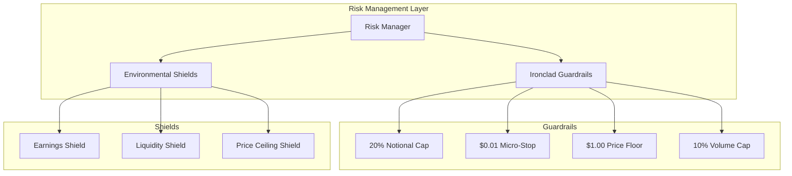

### **Risk Validation Flow**

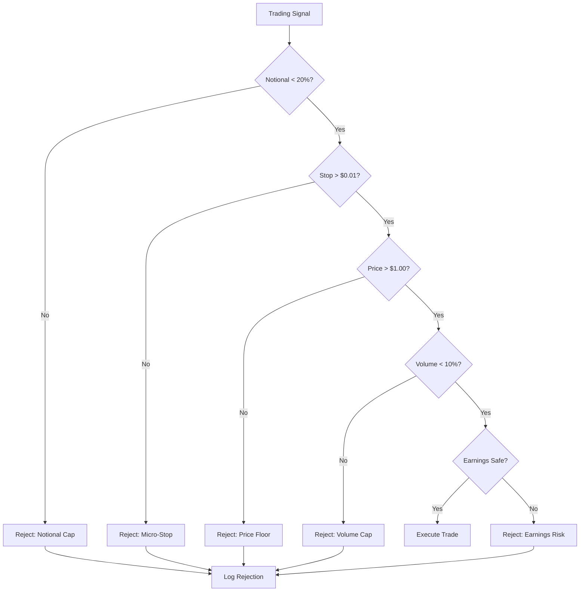

---

## 📡 Communication Flow Architecture

### **System Communication Patterns**

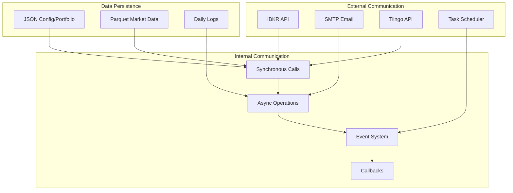

### **Email Communication Flow**

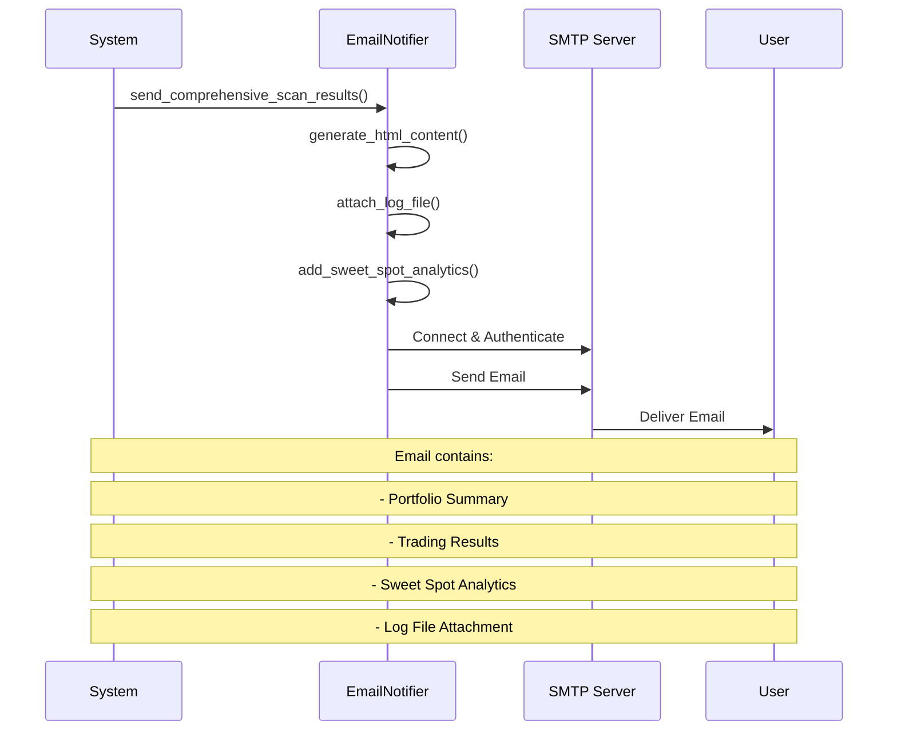

---

## 🚨 Error Handling Architecture

### **Error Handling Strategy**

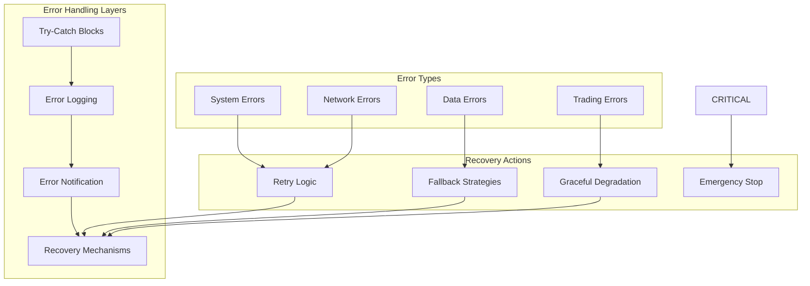

### **Guaranteed Email on Failure**

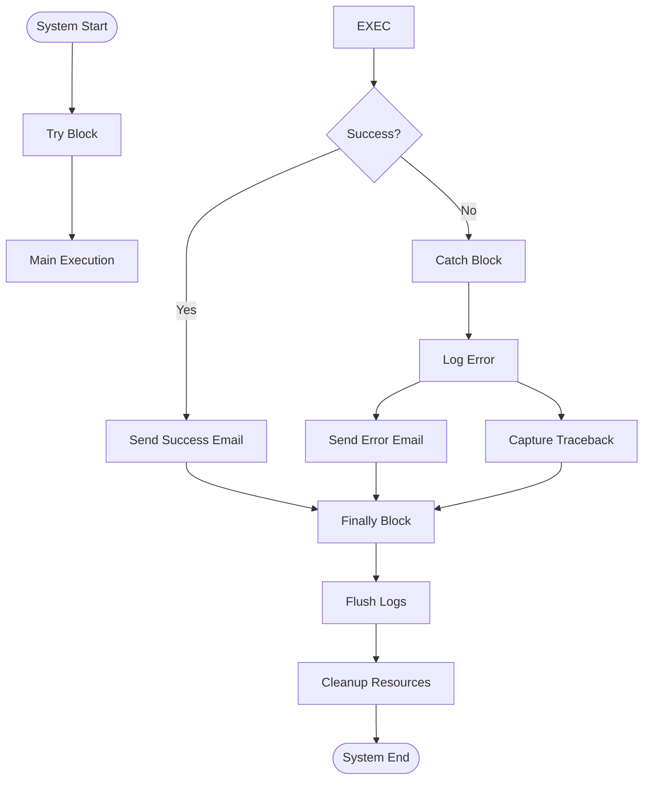

---

## 🎯 Sweet Spot Integration Architecture

### **Sweet Spot Enhanced Flow**

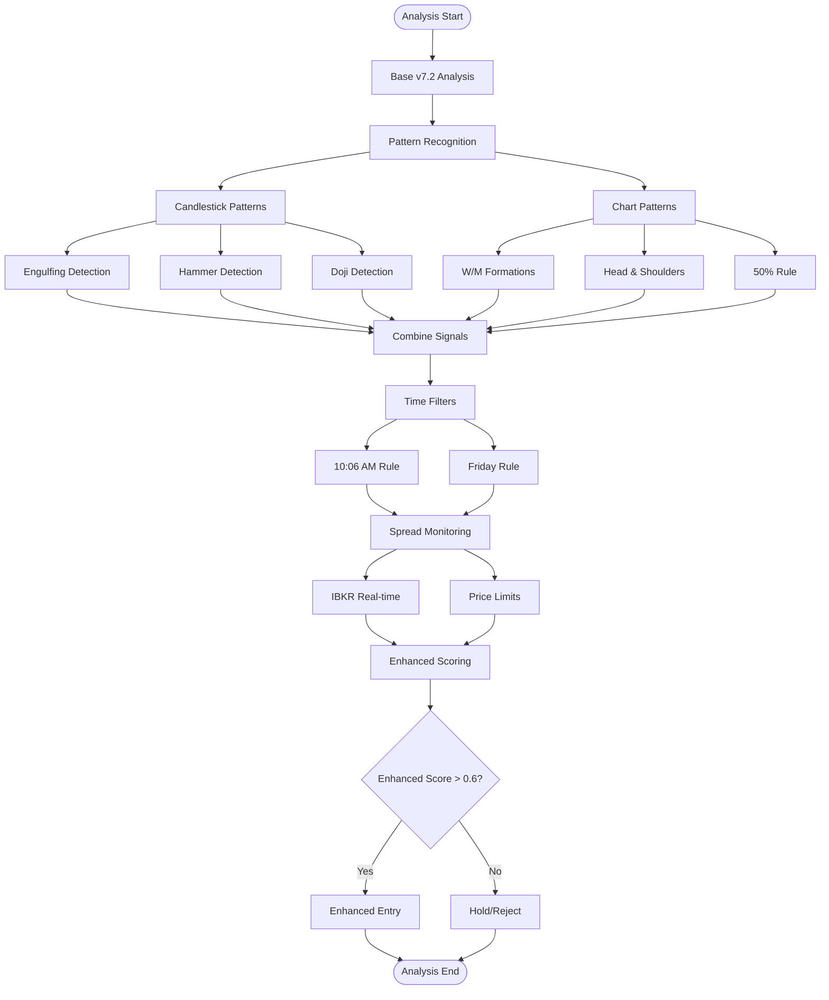

### **Pattern Recognition Architecture**

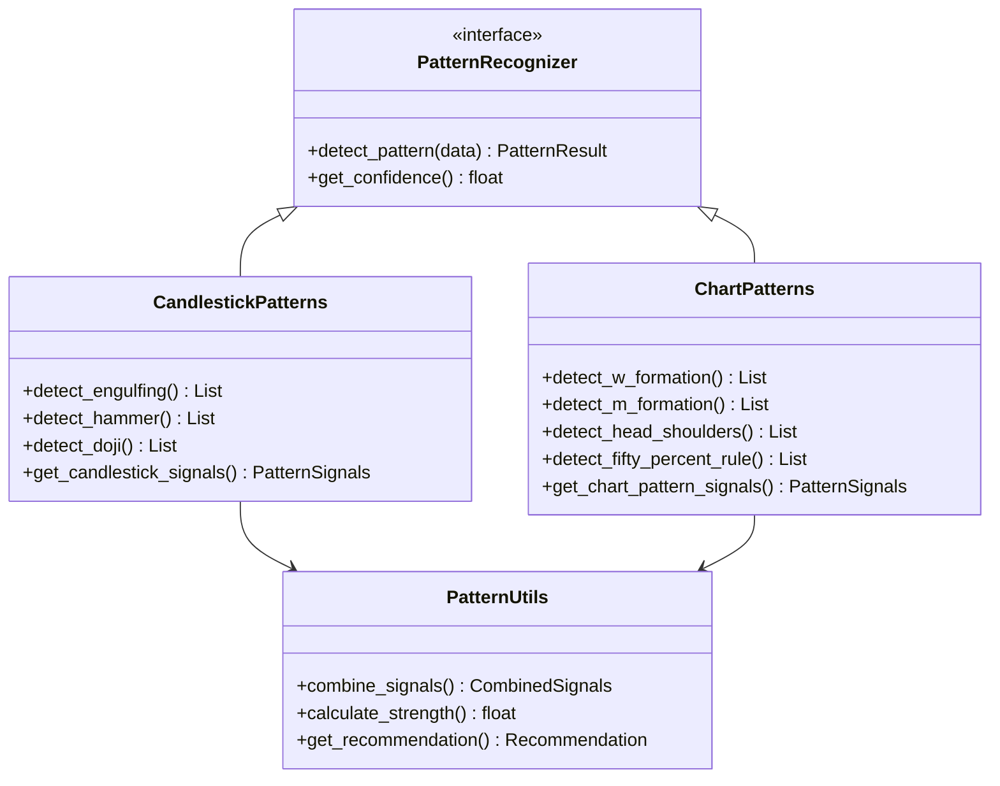

---

## 🔄 Complete System Call Flow

### **End-to-End Execution Flow**

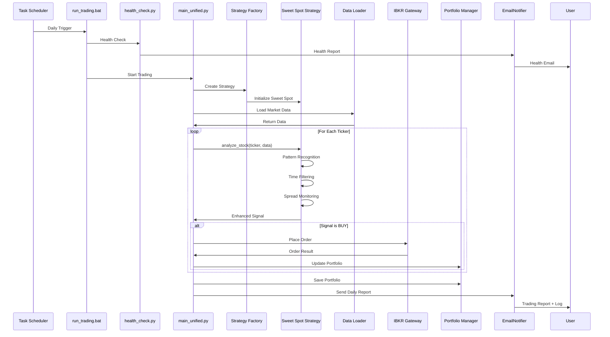

---

## 📋 Component Dependencies

### **Dependency Graph**

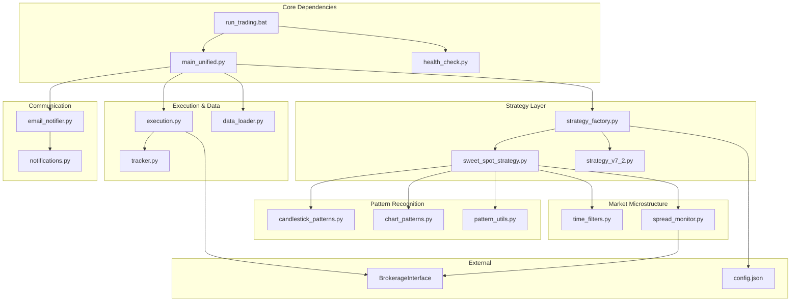

---

## 🎯 Design Patterns Used

### **Implemented Design Patterns**

| Pattern | Implementation | Purpose |
|---------|----------------|---------|
| **Factory Pattern** | `StrategyFactory` | Create strategies based on configuration |
| **Strategy Pattern** | `SweetSpotStrategy`, `V7_2Strategy` | Switchable trading algorithms |
| **Template Method** | `Executor` base class | Common execution flow |
| **Observer Pattern** | Email notifications | System event reporting |
| **Singleton Pattern** | Portfolio state | Single portfolio instance |
| **Facade Pattern** | `main_unified.py` | Simplified interface |
| **Adapter Pattern** | `BrokerageInterface` | IBKR API abstraction |

---

## 📊 Performance & Scaling

### **Performance Characteristics**

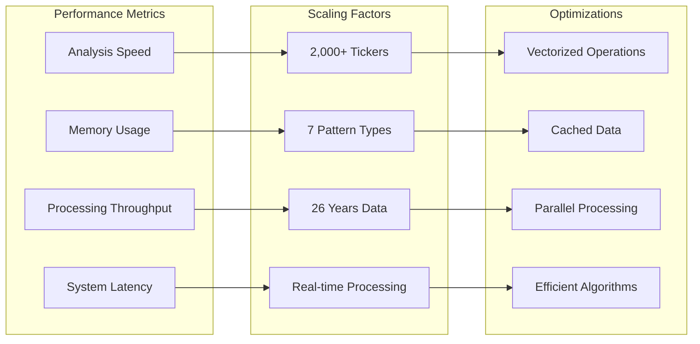

---

## 🔧 Configuration & Rules

### **Configuration Hierarchy**

```
config.json (Root Configuration)
├── STRATEGY_SELECTION
│   ├── "v7_2" (Base Strategy)
│   └── "sweet_spot" (Enhanced Strategy)
├── SWEET_SPOT (Sweet Spot Configuration)
│   ├── enable_patterns
│   ├── enable_spread_monitoring
│   ├── enable_time_filters
│   ├── pattern_weight
│   ├── min_enhanced_score
│   ├── spread_limits
│   ├── time_filters
│   └── pattern_weights
├── TRADING_MODE
│   ├── "PAPER" (Simulation)
│   └── "LIVE" (Real Trading)
├── RISK_TOLERANCE
│   ├── "LOW"
│   ├── "MEDIUM"
│   └── "HIGH"
└── EMAIL_RECIPIENTS
```

### **Execution Rules**

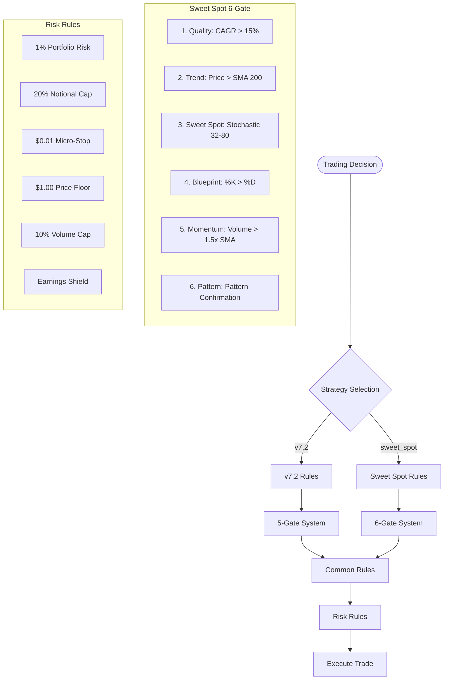

---

## 🎯 Exit & Execution Rules

### **Complete Exit Strategy**

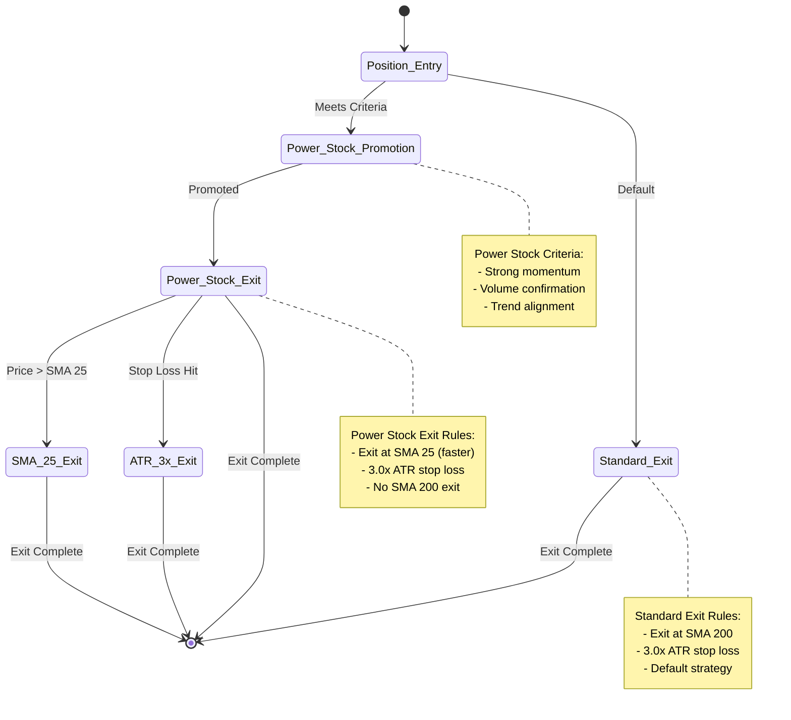

### **Execution Decision Tree**

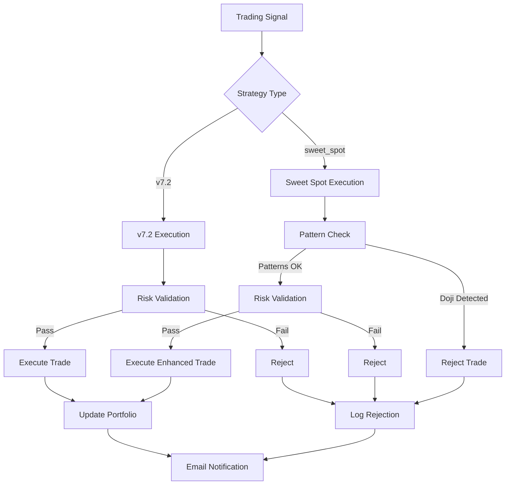

---

## 🏁 Summary

This architecture guide demonstrates:

✅ **Complete System Flow**: From Task Scheduler to Email Delivery
✅ **Entry Points**: All system entry points and their purposes  
✅ **Component Interactions**: Who calls whom and why
✅ **Data Flow**: Complete data pipeline from sources to storage
✅ **Strategy Layer**: Factory pattern and Sweet Spot integration
✅ **Execution Layer**: Trade execution and risk management
✅ **Error Handling**: Guaranteed email notifications
✅ **Design Patterns**: Factory, Strategy, Template, Observer, etc.
✅ **Exit Rules**: Power Stock vs Standard exit strategies
✅ **Configuration**: Complete configuration hierarchy

The system is designed for **production reliability** with **guaranteed daily reporting**, **comprehensive error handling**, and **flexible strategy selection** through the Sweet Spot Blueprint integration.

---

*Last Updated: February 23, 2026*
*Version: 8.0 Total Market Crucible | Sweet Spot Blueprint Integration*
